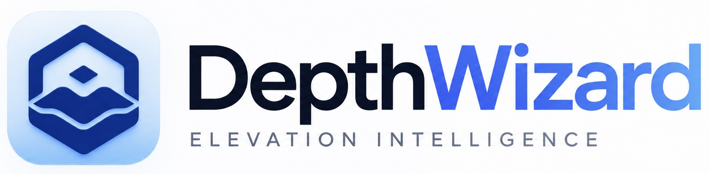

<p align="center">
  
</p>

<p align="center">
  <strong>One optical remote-sensing image in. A truthful relative or evidence-calibrated metric surface—and an analytical 3D world—out.</strong>
</p>

<p align="center">
  <a href="https://github.com/amogh-hub/depthwizard/releases/tag/v0.2.0-sih-final"></a>
  <a href="https://github.com/amogh-hub/depthwizard/actions/workflows/ci.yml"></a>
  <a href="https://github.com/amogh-hub/depthwizard/tree/qualification/evidence-012301b9c1910ef4ccde5b3da5d4e4d94da60ce6/evidence/submission"></a>
  
  
</p>

<p align="center">
  <a href="https://github.com/amogh-hub/depthwizard/releases/tag/v0.2.0-sih-final"><strong>Download the qualified application</strong></a>
  ·
  <a href="docs/judge-evidence-pack.md">Judge evidence</a>
  ·
  <a href="docs/sih26175-problem-statement-traceability.md">Requirement traceability</a>
  ·
  <a href="docs/standalone-architecture.md">Architecture</a>
</p>

# DepthWizard — SIH26175

DepthWizard is the final-system engineering repository for the **ISRO / Smart India Hackathon 2026** problem statement **SIH26175: Single-View Height Estimation and 3D Flythrough**.

It is a unified scientific geospatial workstation that converts a single optical RGB remote-sensing image into a dimensionless relative DSM when scale evidence is unavailable, or an evidence-calibrated metric DSM when defensible georeferencing plus DEM/GCP evidence is available. The persisted surface becomes a textured, measurable and navigable Three.js terrain inside a standalone Tauri desktop application—without requiring users to start a terminal service.

## Qualified release

The mandatory problem-statement scope is **complete, independently evidenced, fail-closed and scientifically honest**.

| Release fact | Qualified value |
|---|---|
| Final status | `PASS_SIH26175_PROBLEM_STATEMENT_COMPLETE` |
| Blocking gates | none |
| Completion gates | 11/11 passed |
| Qualified source | `012301b9c1910ef4ccde5b3da5d4e4d94da60ce6` |
| Final tag | [`v0.2.0-sih-final`](https://github.com/amogh-hub/depthwizard/releases/tag/v0.2.0-sih-final) |
| DMG SHA-256 | `8983ea3a624e677670cf5ebf919e860b253cf2b07c0e8ccc9c169a92c1dd1a15` |
| Clean-machine qualification | [fresh macOS 15 ARM64 run](https://github.com/amogh-hub/depthwizard/actions/runs/34702827804) |
| Release-asset re-verification | [fail-closed finalization run](https://github.com/amogh-hub/depthwizard/actions/runs/34711038120) |
| Exact-commit evidence | [nine-report evidence branch](https://github.com/amogh-hub/depthwizard/tree/qualification/evidence-012301b9c1910ef4ccde5b3da5d4e4d94da60ce6/evidence/submission) |

The release contains the exact qualified Apple Silicon DMG, `SHA256SUMS`, and the evidence/manifests archive. It is ad-hoc signed and intentionally disclosed as **not Apple Developer-ID notarized**.

## Two truthful output paths

| Input | Output claim | Required evidence |
|---|---|---|
| PNG/JPG or imagery without spatial metadata | Dimensionless relative DSM (`rDSM`) | None |
| TIFF/GeoTIFF without accepted calibration | Relative/uncalibrated surface | None; metric claims remain locked |
| Georeferenced GeoTIFF + accepted DEM or distributed GCPs | Metric DSM GeoTIFF | Passed scale, coverage, correlation, conditioning, residual and datum gates |
| Metric DSM + independent reference | Validation products | Separate reference identity and registered support |

Georeferencing alone does not create vertical truth. If the available DEM/GCP evidence is weak, spatially invalid or datum-ambiguous, DepthWizard refuses the metric claim instead of relabelling relative values as metres.

## What the system delivers

- DA3MONO-LARGE as a pinned, hash-verified **relative geometry prior**, bundled for offline inference;
- overlap-aware tiled processing with scene harmonization, source validity/NoData preservation and seam diagnostics;
- robust DEM, six-point GCP, and DEM + GCP calibration using positive-scale Huber/IRLS fitting and leave-one-out validation;
- CRS, transform, ground-sample-distance, vertical datum/reference and DSM/rDSM semantics persisted with provenance;
- float32 GeoTIFF/rDSM output, slope, hillshade, contours, aligned reference, residuals and machine-readable metrics;
- RMSE, MAE, Pearson/Spearman correlation, NMAD, bias, percentile and slope diagnostics;
- textured GLB/LOD terrain with Orbit, Fly, First Person, Top Down and deterministic flythrough navigation;
- registered probe, two-point measurement, elevation profile, structural-footprint height and reference/residual inspection;
- hash-audited project export, reopen/relaunch persistence, bounded processing queue and explicit recovery states;
- loopback-only authenticated sidecar ownership inside the packaged Tauri application.

## Evaluation evidence

| Evaluation target | Result |
|---|---|
| Required terrain stability | Urban, sparse, hilly and forested scenes covered |
| Cross-sensor evaluation | Passed under the frozen geographic/reference separation protocol |
| DSM metrics | RMSE, MAE and correlation reported against independent references |
| Baselines and ablations | Same-input coarse DEM, raw monocular, affine and full-system comparisons preserved |
| Operator workflow | 27/27 checks passed with evidence references |
| Rendering | Sustained mean and p05 performance at or above 30 FPS |
| Stability | Exact-head packaged soak exceeded 7,200 seconds without a blocking failure |
| Fresh-machine deployment | Three consecutive offline packaged workflows passed on a fresh Apple Silicon runner |

The compact reviewer index is [`docs/judge-evidence-pack.md`](docs/judge-evidence-pack.md). The machine-readable artifacts and checksum manifest live on the exact-commit evidence branch and in the final release archive.

## Five-minute judge workflow

1. Download the DMG and `SHA256SUMS` from the [qualified release](https://github.com/amogh-hub/depthwizard/releases/tag/v0.2.0-sih-final).
2. Verify that the DMG SHA-256 is `8983ea3a624e677670cf5ebf919e860b253cf2b07c0e8ccc9c169a92c1dd1a15`.
3. Install and launch DepthWizard from Finder. Because the build is ad-hoc signed, macOS may require **Control-click → Open** on first launch.
4. Import PNG/JPG to reconstruct a dimensionless rDSM, or import GeoTIFF and add accepted DEM/GCP evidence for a metric DSM.
5. Build the terrain; switch between texture, DSM, slope, hillshade and contours; navigate in First Person or aerial modes.
6. Probe elevations, measure Δz, draw a profile, estimate a structural footprint, or load an independent reference.
7. Export the project bundle, quit, relaunch and reopen it to confirm persisted scientific state.

The core reconstruction workflow remains offline after installation. Online map tiles, cloud inference and undocumented model caches are not required.

## Architecture

```text
Optical RGB
    │
    ├── ingest + CRS/validity/quality inspection
    │
    ├── pinned monocular geometry prior
    │       └── tiled relative surface + seam harmonization
    │
    ├── no defensible scale evidence ───────────────► dimensionless rDSM
    │
    └── accepted DEM / GCP evidence
            └── robust calibration + datum gates ──► metric DSM GeoTIFF
                                                        │
                                                        ├── validation products
                                                        └── textured analytical 3D terrain
```

The desktop application owns an authenticated local scientific sidecar, per-process boot identity, project state, raster/mesh artifacts and analyst tools. See [`docs/standalone-architecture.md`](docs/standalone-architecture.md) and the architecture decisions in [`docs/adr/`](docs/adr/).

## Scientific claim boundaries

- DA3MONO-LARGE is not presented as an absolute satellite-height oracle.
- Metric elevation is claimed only after accepted geodetic evidence calibration.
- Native confidence is exported only when an estimator defines it; no uncertainty raster is synthesized for the production path.
- Absolute accuracy remains bounded by image geometry, occlusion/building lean, calibration quality, independent-reference quality and vertical-datum compatibility.
- Research refiners remain outside production unless they beat the frozen production path under independent same-input gates.

## Source verification

Python and scientific core:

```bash
uv lock --check
uv sync --frozen --python 3.12 --extra dev --extra ml
.venv/bin/python scripts/verify.py
```

Desktop frontend:

```bash
cd apps/desktop
npm ci --no-audit --no-fund
npm test
npm run build
```

Core CLI:

```bash
depthwizard inspect imagery.tif
depthwizard calibrate-dem relative_height.tif srtm.tif dsm.tif
depthwizard validate-dsm dsm.tif reference_lidar.tif evidence/
depthwizard serve --host 127.0.0.1 --port 8765
```

Resolver locks for Python, npm and Cargo are committed and audited. Supply-chain reports are generated with `python -m scripts.generate_supply_chain_reports`.

## Documentation map

1. [`MASTER_SPEC.md`](MASTER_SPEC.md) — authoritative specification and release closure
2. [`docs/requirements-traceability.yaml`](docs/requirements-traceability.yaml) — requirement-to-code-to-evidence mapping
3. [`docs/judge-evidence-pack.md`](docs/judge-evidence-pack.md) — compact reviewer index
4. [`docs/adr/`](docs/adr/) — scientific and architecture decisions
5. [`docs/release-playbook.md`](docs/release-playbook.md) — guarded release procedure

DepthWizard does not depend on marketing claims for acceptance: every mandatory capability is tied to code, a verification gate and exact-commit evidence.
